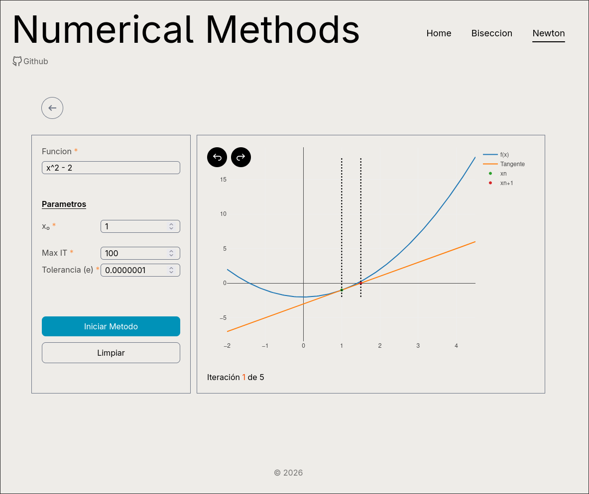

# NumericalMethods

Visualizador del comportamiento de los metodos numericos de biseccion y newton raphson programado en angular



---

## Stack Tecnologico

- Framework: Angular 22.0.0
- Estilos: Tailwind CSS
- Graficos: plotlyjs
- Operaciones Matematicas: Mathjs

---

## Folder Structure

```bash
├── public
│   └── images --> home Image
└── src
    └── app
        ├── components
        │   ├── back-button
        │   └── loadindicator
        ├── layouts
        │   └── app-layout --> header de navegacion
        ├── pages
        │   ├── biseccion-page --> 
        │   ├── main-page
        │   ├── newton-page -->
        │   └── not-found-page
        ├── services --> logica matematica
        └── types --> configuracion de plotlyjs
```

## Development server

To start a local development server, run:

```bash
ng serve
```

Once the server is running, open your browser and navigate to `http://localhost:4200/`. The application will automatically reload whenever you modify any of the source files.


## Building

To build the project run:

```bash
ng build
```

##
